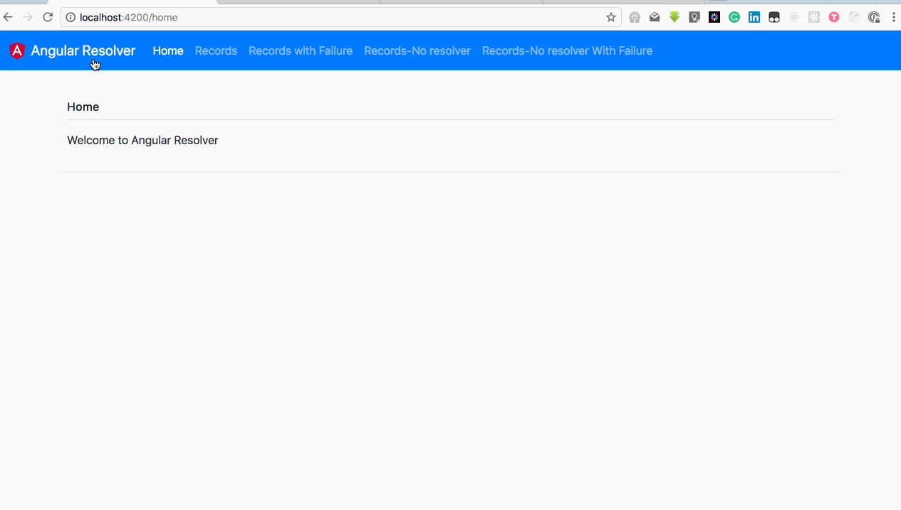

# Resolver

This project was generated with [Angular CLI](https://github.com/angular/angular-cli) version 1.6.4.
## Screenshot

## Dependencies
* [Bootstrap](https://github.com/twbs/bootstrap) : just the css was used, check [.angular-cli.json](.angular-cli.json) **styles** array where it was added to the project
* [ng2-slim-loading-bar](https://github.com/akserg/ng2-slim-loading-bar) : Used for managing our page loader, using the inbuilt service to trigger our loader, check [app.component.ts](src/app/app.component.ts), also the [styles.css](src/styles.css) and don't forget to import it to your [app.module.ts](src/app/app.module.ts), **imports** array 
* [ngAlert](https://github.com/theo4u/ngAlert) : Used in showing app-level alert error message, check [app.component.ts](src/app/app.component.ts), also the [styles.css](src/styles.css) and don't forget to import it to your [app.module.ts](src/app/app.module.ts), **imports** array 

## Development server

Run `ng serve` for a dev server. Navigate to `http://localhost:4200/`. The app will automatically reload if you change any of the source files.

## Code scaffolding

Run `ng generate component component-name` to generate a new component. You can also use `ng generate directive|pipe|service|class|guard|interface|enum|module`.

## Build

Run `ng build` to build the project. The build artifacts will be stored in the `dist/` directory. Use the `-prod` flag for a production build.

## Running unit tests

Run `ng test` to execute the unit tests via [Karma](https://karma-runner.github.io).

## Running end-to-end tests

Run `ng e2e` to execute the end-to-end tests via [Protractor](http://www.protractortest.org/).

## Further help

To get more help on the Angular CLI use `ng help` or go check out the [Angular CLI README](https://github.com/angular/angular-cli/blob/master/README.md).
